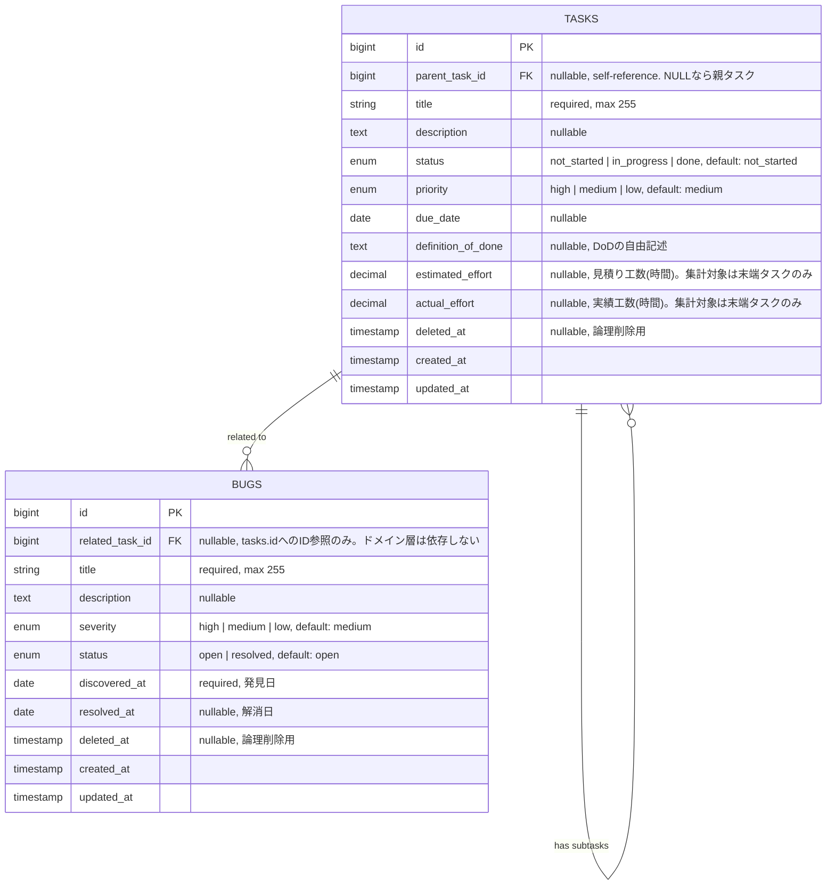

# ER図(設計)

[client-requirements.md](../requirements/client-requirements.md)のスコープと[ADR-0001](../adr/0001-vertical-slice-and-hexagonal-architecture.md)のドメインモデル(`Task`エンティティ、`TaskStatus`/`TaskPriority`値オブジェクト)に基づくテーブル設計。[ADR-0002](../adr/0002-evm-progress-and-bug-tracking.md)により、工数カラムと`bugs`テーブルを追加している。

## 設計方針・決定事項

- **テーブルは`tasks`単一**。「プロジェクト」概念を持たない([client-requirements.md](../requirements/client-requirements.md)のスコープ外決定)ため、ユーザーテーブルも認証機能なしのため作成しない。
- **親子階層は`tasks`テーブルの自己参照(`parent_task_id`)で表現する。** 親子2階層(親タスク→子タスクの1段のみ)という制約はDBのCHECK制約では表現できない(MySQLのCHECK制約は同一テーブルの他行を参照できない)ため、**Application層(ユースケース)でのビジネスルールとして enforcement する**(子タスクにさらに子を作ろうとした場合はドメイン例外を返す)。
- **ステータス・優先度はENUMカラムとして`tasks`テーブルに直接持たせる**(別テーブルに切り出さない)。値の種類が固定(ステータス3種・優先度3段階)でスコープ内では変更予定がないため、正規化による恩恵よりもシンプルさを優先した。Infrastructure層でENUM文字列とDomain層の`TaskStatus`/`TaskPriority`値オブジェクトを相互変換する。
- **タスクの削除は論理削除(soft delete)とする。** `deleted_at`カラム(Laravel `SoftDeletes`)を持たせ、物理削除は行わない。[client-requirements.md](../requirements/client-requirements.md)の「削除」CRUD要件はそのまま実現しつつ、誤削除からの復旧を可能にする。
- **親タスクを削除した場合、子タスクも合わせて論理削除する。** DBの`ON DELETE CASCADE`は物理削除にしか作用しないため、Application層のユースケース(`DeleteTask`)で「親タスク削除時は配下の子タスクも論理削除する」処理を明示的に実装する。`parent_task_id`のFK自体は`ON DELETE RESTRICT`とし、アプリを経由しない物理削除(誤操作によるDB直接操作等)から子タスクが孤立するのを防ぐ。
- **工数(`estimated_effort`/`actual_effort`)は末端タスク(子タスクを持たないタスク)にのみ集計対象として扱う。** [ADR-0002](../adr/0002-evm-progress-and-bug-tracking.md)の通り、親タスクにも値を入力すること自体は妨げないが、EVM計算(`Progress`スライス)は常に末端タスクの値のみを合計し、ダブルカウントを防ぐ。カラム自体はDB制約ではなくApplication層の集計ロジックでこの区別を行う。
- **バグは`tasks`とは独立した`bugs`テーブルで管理する。** `related_task_id`で関連タスクを参照できるが、これは単なる外部キー(ID参照)であり、Bugスライスのドメイン層はTaskのドメインオブジェクトに依存しない([ADR-0002](../adr/0002-evm-progress-and-bug-tracking.md))。

## Alternatives Considered(検討した代替案)

| 代替案 | 却下理由 |
|---|---|
| 物理削除(DELETE文で行ごと削除) | 誤操作から復旧できない。親削除時にCASCADEで子タスクも物理的に失われ、監査・振り返り(retrospective)の材料も残らない |
| ステータスに「却下」を追加し削除操作自体をなくす | 既に確定済みの3状態(未着手/進行中/完了)を変更することになり、かつ[client-requirements.md](../requirements/client-requirements.md)が明記する「削除」というCRUD要件の意味と実装がズレる |
| ステータス・優先度を別テーブル(`task_statuses`, `task_priorities`)に正規化 | 値が固定かつ少数(3種)で、今回のスコープでは追加・変更の予定がないため、テーブル分割のメリットよりJOIN増加のデメリットが上回ると判断 |
| 親子関係を独立した中間テーブル(`task_hierarchies`)で表現 | 2階層までしか許可しないシンプルな階層に対しては過剰設計。自己参照FK1本で十分表現できる |

## ER図

## カラム定義(Laravelマイグレーション対応)

| カラム | 型 | 制約 | 備考 |
|---|---|---|---|
| `id` | `bigint unsigned` | PK, auto increment | |
| `parent_task_id` | `bigint unsigned` | FK → `tasks.id`, nullable, `ON DELETE RESTRICT` | NULLなら親タスク。値があれば子タスク |
| `title` | `varchar(255)` | NOT NULL | |
| `description` | `text` | nullable | |
| `status` | `enum('not_started','in_progress','done')` | NOT NULL, default `not_started` | |
| `priority` | `enum('high','medium','low')` | NOT NULL, default `medium` | |
| `due_date` | `date` | nullable | |
| `definition_of_done` | `text` | nullable | |
| `estimated_effort` | `decimal(5,2)` | nullable | 見積り工数(時間)。EVM集計は末端タスクの値のみ合計する |
| `actual_effort` | `decimal(5,2)` | nullable | 実績工数(時間)。EVM集計は末端タスクの値のみ合計する |
| `deleted_at` | `timestamp` | nullable | Laravel `SoftDeletes`。NULL以外なら論理削除済み |
| `created_at` / `updated_at` | `timestamp` | Laravel標準 | |

### `bugs`テーブル

| カラム | 型 | 制約 | 備考 |
|---|---|---|---|
| `id` | `bigint unsigned` | PK, auto increment | |
| `related_task_id` | `bigint unsigned` | FK → `tasks.id`, nullable, `ON DELETE SET NULL` | ID参照のみ。関連タスクが削除されてもバグ記録自体は残す |
| `title` | `varchar(255)` | NOT NULL | |
| `description` | `text` | nullable | |
| `severity` | `enum('high','medium','low')` | NOT NULL, default `medium` | |
| `status` | `enum('open','resolved')` | NOT NULL, default `open` | |
| `discovered_at` | `date` | NOT NULL | |
| `resolved_at` | `date` | nullable | |
| `deleted_at` | `timestamp` | nullable | Laravel `SoftDeletes` |
| `created_at` / `updated_at` | `timestamp` | Laravel標準 | |

## ドメインモデルとの対応(ADR-0001, ADR-0002)

- `tasks`テーブル1行 = Domain層の`Task`エンティティ1インスタンス
- `status`カラム ⇔ `TaskStatus`値オブジェクト、`priority`カラム ⇔ `TaskPriority`値オブジェクト(Infrastructure層のリポジトリ実装で相互変換)
- 「子タスクは孫タスクを持てない」という階層制約は、Domain/Application層の`CreateTask`ユースケースで検証する(DB制約ではなくビジネスルールとして実装)
- 「親タスク削除時に子タスクも論理削除する」処理は、`DeleteTask`ユースケース(Application層)がリポジトリを通じて実行する
- `bugs`テーブル1行 = `Bug`スライスの`Bug`エンティティ1インスタンス。`related_task_id`はID参照のみで、`Task`エンティティへの直接依存は持たない
- EVM指標・バグ統計は`Progress`スライスが`tasks`/`bugs`を直接クエリして算出する(CQRSの考え方。Task/Bugスライスのユースケースは経由しない)

## フォローアップ

- マイグレーション作成: [#13](https://github.com/YoshinoriSawaya/task-pm-app/issues/13)(`deleted_at`を含めてSoftDeletesを有効化する)、工数カラム・`bugs`テーブルの追加マイグレーションは別Issueで管理
- API設計([#7](https://github.com/YoshinoriSawaya/task-pm-app/issues/7))は本テーブル構造を前提に進める
