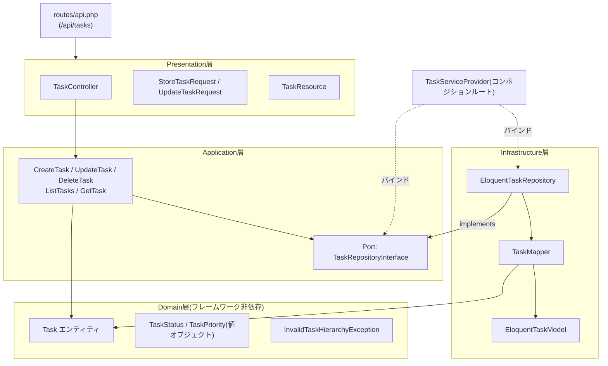

# レイヤー構成(ヘキサゴナルアーキテクチャ)

[ADR-0001](../adr/0001-vertical-slice-and-hexagonal-architecture.md)の方針を、Taskスライスの具体的なクラス/ファイル構成に落とし込む。
[ER図](er-diagram.md)・[API設計](api-design.md)で確定した内容がこの構成の入出力契約になる。

## バックエンド: `backend/app/Features/Task/`

| 層 | 役割 | 主なクラス/ファイル |
|---|---|---|
| **Domain** | ビジネスルールの核。フレームワーク非依存 | `Domain/Task.php`(エンティティ)、`Domain/TaskStatus.php`・`Domain/TaskPriority.php`(値オブジェクト)、`Domain/Exceptions/InvalidTaskHierarchyException.php`(2階層制約違反時の例外) |
| **Application** | ユースケースとポート(インターフェース)の定義 | `Application/UseCases/CreateTask.php`・`UpdateTask.php`・`DeleteTask.php`・`ListTasks.php`・`GetTask.php`、`Application/Ports/TaskRepositoryInterface.php` |
| **Infrastructure** | ポートのアダプタ実装。Laravel/Eloquentへの依存はここに閉じ込める | `Infrastructure/Persistence/EloquentTaskModel.php`(Eloquentモデル)、`Infrastructure/Persistence/EloquentTaskRepository.php`(`TaskRepositoryInterface`実装)、`Infrastructure/Persistence/TaskMapper.php`(EloquentモデルとDomainエンティティの相互変換) |
| **Presentation** | HTTP境界 | `Presentation/Http/Controllers/TaskController.php`、`Presentation/Http/Requests/StoreTaskRequest.php`・`UpdateTaskRequest.php`([API設計](api-design.md)のバリデーション定義を実装)、`Presentation/Http/Resources/TaskResource.php`(レスポンス整形、`subtasks`のネストを含む) |

配線(DI)は`Application/Ports/TaskRepositoryInterface` → `Infrastructure/Persistence/EloquentTaskRepository`のバインドを`Providers/TaskServiceProvider.php`(コンポジションルート)で行う。Domain/ApplicationはInfrastructureの実装クラスを直接参照しない。

## 依存関係図

**依存の向き**(依存性逆転の原則): DomainはどこにもDependしない。ApplicationはDomainのみに依存し、Portは自分自身(Application)で定義する。InfrastructureはApplicationのPort(インターフェース)を実装する形でApplicationに依存する。PresentationはApplicationのユースケースを呼び出す。ServiceProviderだけが実行時にInfrastructureとApplicationを結びつける(コンパイル時の依存はない)。

## フロントエンド: `frontend/src/features/task/`

ADR-0001の通り、バックエンドほど厳密な多層化はせず3層に留める。

| 層 | 役割 | 主なファイル |
|---|---|---|
| **components/** | UI表示 | `TaskList.tsx`(トップレベル一覧+ネストした子タスク表示)、`TaskForm.tsx`(作成・編集フォーム)、`TaskDetail.tsx` |
| **hooks/** | ユースケース相当。状態管理とAPI呼び出しの橋渡し | `useTasks.ts`(一覧取得)、`useCreateTask.ts`、`useUpdateTask.ts`、`useDeleteTask.ts` |
| **api/** | インフラ相当。HTTP通信の実体 | `taskApiClient.ts`([API設計](api-design.md)の`/api/tasks`エンドポイントを叩く薄いラッパー) |

`types/task.ts`にAPIレスポンス([API設計](api-design.md)のTaskリソース)と対応する`Task`・`TaskStatus`・`TaskPriority`型を定義し、components/hooks/api間で共有する。

## フォローアップ

- 本構成に基づき、バックエンド実装([#13](https://github.com/YoshinoriSawaya/task-pm-app/issues/13)〜[#16](https://github.com/YoshinoriSawaya/task-pm-app/issues/16))・フロントエンド実装([#18](https://github.com/YoshinoriSawaya/task-pm-app/issues/18)〜[#21](https://github.com/YoshinoriSawaya/task-pm-app/issues/21))を進める
- リファクタリングフェーズ([#26](https://github.com/YoshinoriSawaya/task-pm-app/issues/26)〜[#28](https://github.com/YoshinoriSawaya/task-pm-app/issues/28))では、この構成に反する「Before(密結合)」実装(例: Controllerから直接Eloquentモデルを操作する等)をあえて作り、After(本構成)へのリファクタリングとして比較する
