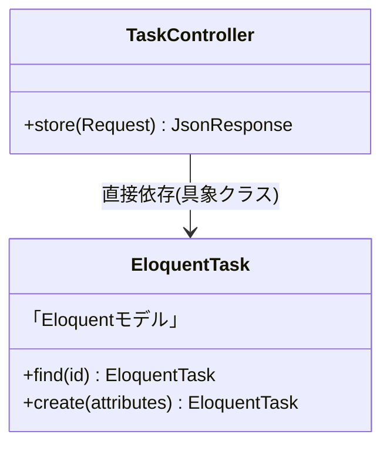
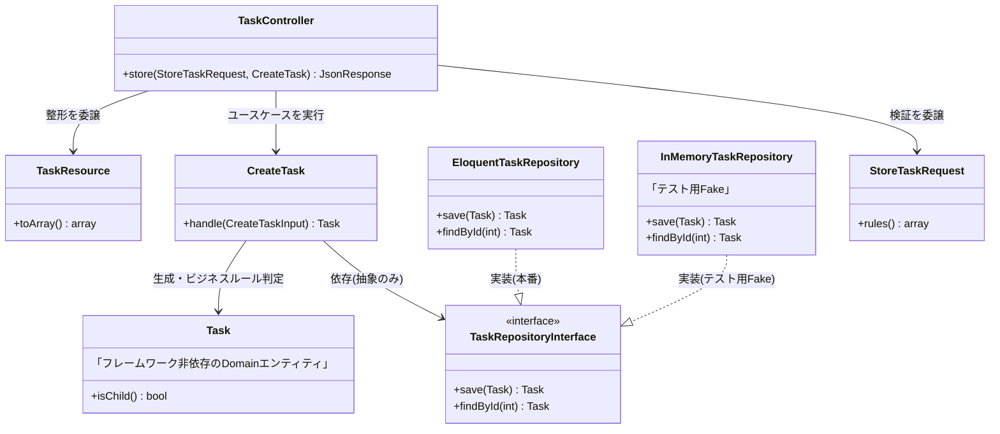

# Before/After設計比較: タスク作成機能

[CLAUDE.md](../../CLAUDE.md)の目的にある「SOLID原則に基づいた設計とそのレビュー能力」を、
具体的なコードで示すための資料。[フェーズ6](../pmbok/wbs.md)([#29](https://github.com/YoshinoriSawaya/task-pm-app/issues/29))の成果物。

## 対象の選定([#26](https://github.com/YoshinoriSawaya/task-pm-app/issues/26))

**タスク作成(`POST /api/tasks`)** を比較対象に選んだ。理由:

- 単なるCRUDではなく、「2階層制約(子タスクはさらに子を持てない)」という実在のビジネスルールを含み、Before/Afterでの設計判断の違いが具体的なコードとして表れやすい
- 実際に`/code-review`で「論理削除済みタスクを親に指定できてしまう」というバグが見つかった箇所([change-log.md](../pmbok/change-log.md) C10)であり、「密結合な設計だとこの種のバグがどう混入しやすいか」を実例で示せる

「Before」は、[docs/architecture/refactoring-example/before/TaskController.php](refactoring-example/before/TaskController.php)として、
**もしADR-0001(Vertical Slice + Hexagonal)を採用せず、Laravelのデフォルトの発想のまま実装していたら**という
思考実験のコードを新規に書き起こした(実際に動くコードではなく、composerのオートロード対象にもルーティングにも含めない)。
「After」は本プロジェクトが実際にTDDで実装した、現在の本番コード([app/Features/Task/](../../backend/app/Features/Task/))そのものである。

## Before: 単一Controllerへの集約



1メソッド(`store`)が以下をすべて背負っている(全文は[before/TaskController.php](refactoring-example/before/TaskController.php)参照):

1. HTTPリクエストの受け取り
2. 入力バリデーション(ベタ書き)
3. ビジネスルール(2階層制約)の判定
4. Eloquentモデルへの直接的な永続化
5. レスポンスの整形

### 違反しているSOLID原則

| 原則 | 違反内容 |
|---|---|
| **S**(単一責任) | 1メソッドが「HTTP処理・検証・ビジネスルール・永続化・整形」という5つの異なる関心事、5つの異なる変更理由を持つ |
| **O**(開放閉鎖) | 新しいビジネスルール(例: 見積り工数の上限チェック)を追加するたびに、この巨大メソッド自体を直接編集する必要がある。既存コードを変更せずに振る舞いを拡張する余地がない |
| **D**(依存性逆転) | `TaskController`が抽象(インターフェース)ではなく、Eloquentという具象実装に直接依存している。永続化方法を差し替える(あるいはテスト用のFakeに差し替える)手段が存在しない |

(L・Iは、この規模の単一クラスにはそもそも継承階層や複数インターフェースが存在しないため、違反として顕在化しない。裏を返せば「抽象がまったく存在しない」こと自体がDIP違反の根本原因になっている)

## After: Vertical Slice + Hexagonalへの分割([#27](https://github.com/YoshinoriSawaya/task-pm-app/issues/27))



同じ「タスク作成」を、責務ごとに分割した([app/Features/Task/](../../backend/app/Features/Task/)、ADR-0001):

| 層 | クラス | 責務 |
|---|---|---|
| Presentation | [`TaskController`](../../backend/app/Features/Task/Presentation/Http/Controllers/TaskController.php) | HTTPリクエスト/レスポンスの窓口のみ |
| Presentation | [`StoreTaskRequest`](../../backend/app/Features/Task/Presentation/Http/Requests/StoreTaskRequest.php) | 入力バリデーションのみ |
| Application | [`CreateTask`](../../backend/app/Features/Task/Application/UseCases/CreateTask.php) | 2階層制約というビジネスルールの判定のみ |
| Application | [`TaskRepositoryInterface`](../../backend/app/Features/Task/Application/Ports/TaskRepositoryInterface.php) | 永続化の抽象(Port)。Application層はこれ以外の永続化手段を一切知らない |
| Infrastructure | [`EloquentTaskRepository`](../../backend/app/Features/Task/Infrastructure/Persistence/EloquentTaskRepository.php) | `TaskRepositoryInterface`のEloquentによる実装(Adapter) |
| Presentation | [`TaskResource`](../../backend/app/Features/Task/Presentation/Http/Resources/TaskResource.php) | レスポンス整形のみ(Bug/Progress等、他エンドポイントとも共通化) |
| Domain | [`Task`](../../backend/app/Features/Task/Domain/Task.php) | フレームワーク非依存のエンティティ。`isChild()`という振る舞いを持つ |

### 各SOLID原則がどう満たされるようになったか

| 原則 | Afterでの実現方法 |
|---|---|
| **S**(単一責任) | 上表の通り、7クラスそれぞれが1つの変更理由しか持たない。バリデーションルールの変更は`StoreTaskRequest`だけ、レスポンス形式の変更は`TaskResource`だけを触ればよい |
| **O**(開放閉鎖) | 新しいビジネスルールは`CreateTask::handle()`内に追加するだけで済み、`TaskController`や永続化層には手を入れない。永続化方式を変える場合も`TaskRepositoryInterface`の新しい実装を追加するだけで、`CreateTask`側は無変更のまま拡張できる |
| **L**(リスコフの置換) | `TaskRepositoryInterface`の実装(`EloquentTaskRepository`、テスト用の`InMemoryTaskRepository`)はどちらを渡しても`CreateTask`は同じように振る舞う。実際に本番用とテスト用を透過的に差し替えて動作させている(下記) |
| **I**(インターフェース分離) | `TaskRepositoryInterface`はTaskに関する操作のみを持つ、Task専用の小さなインターフェース。Bugスライスは独立した`BugRepositoryInterface`を持ち、「巨大な汎用Repositoryインターフェース」に両者を無理に押し込めていない |
| **D**(依存性逆転) | `CreateTask`は`EloquentTaskRepository`という具象クラスを一切知らず、`TaskRepositoryInterface`という抽象にのみ依存する。具体的な結び付けは[`TaskServiceProvider`](../../backend/app/Features/Task/Providers/TaskServiceProvider.php)(合成のルート)が行う |

## テスト容易性の実証

Before(Eloquentへの直接依存)では、ビジネスルールを検証するだけでも実DB・HTTPレイヤー一式を起動する
Featureテストが必須になる。Afterでは`CreateTask`が抽象(`TaskRepositoryInterface`)にしか依存しないため、
DB・HTTPを一切介さない**純粋なUnitテスト**が書ける。これは仮説ではなく、実際に
[backend/tests/Unit/Task/CreateTaskTest.php](../../backend/tests/Unit/Task/CreateTaskTest.php)として実装・グリーン確認済み:

```php
// tests/Unit/Task/Fakes/InMemoryTaskRepository.php が
// TaskRepositoryInterfaceを実装する、DBを一切使わないFake
$repository = new InMemoryTaskRepository();
$useCase = new CreateTask($repository);

$task = $useCase->handle($input);
```

実行時間の面でも差が出る: 実DBを使うFeatureテスト(`tests/Feature/Task/`)が1件あたり0.15〜0.3秒程度かかるのに対し、
このUnitテストは1件あたり0.01〜0.4秒(初回のクラスロードを除けばほぼ瞬時)で完了する。

## まとめ

| 観点 | Before | After |
|---|---|---|
| 1クラスの責務数 | 5(HTTP/検証/ルール/永続化/整形) | 1クラス1責務(7クラスに分割) |
| ビジネスルールを変えたい時に触るファイル数 | 1(ただし巨大) | 1(`CreateTask`のみ、他は無変更) |
| 永続化方式を差し替える難易度 | 困難(Eloquent直書き) | 容易(`TaskRepositoryInterface`の新実装を追加するだけ) |
| DBなしでビジネスルールを検証できるか | 不可能 | 可能(実装・確認済み) |
| 論理削除済みタスクを親に指定できてしまうバグ | 混入した実績あり([change-log.md](../pmbok/change-log.md) C10) | FormRequestの検証ルール1箇所を直せば全エンドポイントに反映される |
